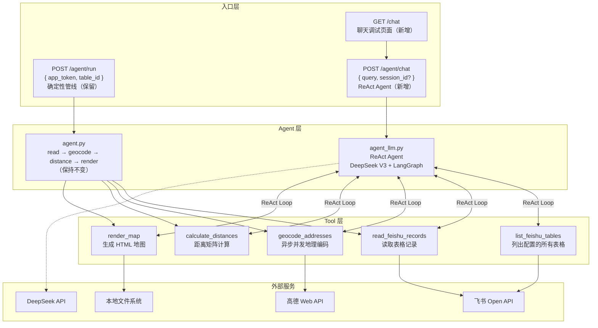

# LLM Agent 升级 — DeepSeek ReAct Agent

## Summary

将当前基于确定性 LangGraph 管线的飞书地图工具，升级为 **DeepSeek V3 驱动的 ReAct Agent**。用户通过自然语言对话描述需求，Agent 自主推理并调用工具完成地图生成。新增 `/agent/chat` API 端点和 `/chat` 调试聊天界面，原有 `/agent/run` 确定性管线保留不变。

**核心变化**：
- **无 LLM → DeepSeek V3**：函数调用驱动工具编排
- **固定管线 → ReAct 循环**：LLM 自主决定调用哪些工具、什么顺序
- **同步串行 → 异步并发**：高德地理编码改为 `asyncio + aiohttp` 并发
- **curl 调试 → 聊天 UI**：`/chat` 页面提供即时对话调试能力

## Architecture Diagram

## Technical Approach

### Phase 1: 基础设施准备（Task 1-3, 8）

先打好基础，不影响现有功能：

1. **配置扩展** — `config.py` 加两个新字段，`.env` 加对应的环境变量
2. **飞书工具增强** — `FeishuClient.list_tables()` 调用飞书 REST API
3. **高德异步化** — `AMapClient` 新增异步方法，原同步方法保留
4. **依赖安装** — `pip install langchain-openai aiohttp`

### Phase 2: Agent 核心（Task 4-5）

1. **LangChain Tool 包装** — 把现有功能包装成 LLM 可调用的工具函数
2. **ReAct Agent** — System Prompt 设计：中文地图助手，先查表再读数据，生成地图后返回 URL

### Phase 3: 接口层（Task 6-7）

1. **Chat API** — 新增 `/agent/chat`，与 `/agent/run` 平行存在
2. **Chat UI** — 单文件静态页面，FastAPI 托管

### Phase 4: 清理与验证（Task 9-10）

- 删除 `main_test.py` 及其依赖
- 端到端验证

## Key Decisions

1. **双端点共存** — `/agent/run`（确定性） + `/agent/chat`（LLM），各司其职
2. **单轮对话 + 预留 session_id** — 快速上线，接口设计不阻碍后续多轮
3. **异步并发保留同步方法** — 确定性管线继续用同步，LLM Agent 用异步
4. **纯 HTML 聊天 UI** — 零构建步骤，开发期调试够用
5. **DeepSeek 通过 OpenAI 兼容接口** — 无需额外适配层
6. **app_token 在 .env 中以 JSON 维护** — 可配置可扩展
## Tasks

- [ ] Task 1: 配置层升级 — config.py 新增 deepseek_api_key 和 feishu_app_tokens 配置项
- [ ] Task 2: 飞书工具增强 — FeishuClient 新增 list_tables 方法
- [ ] Task 3: 高德工具异步化 — AMapClient 新增异步并发地理编码方法
- [ ] Task 4: LangChain 工具包装 — 新建 tools/llm_tools.py，将5个工具包装为 LangChain @tool
- [ ] Task 5: ReAct Agent 实现 — 新建 agent_llm.py，使用 langgraph.prebuilt.create_react_agent
- [ ] Task 6: Chat API 端点 — main.py 新增 POST /agent/chat 端点
- [ ] Task 7: 聊天调试 UI — 新建 static/chat.html，新增 GET /chat 路由
- [ ] Task 8: 依赖更新 — requirements.txt 新增 langchain-openai, aiohttp
- [ ] Task 9: 代码清理 — 删除 main_test.py，移除不再需要的依赖
- [ ] Task 10: 构建验证 — 确保所有模块可导入，health/chat 端点正常
