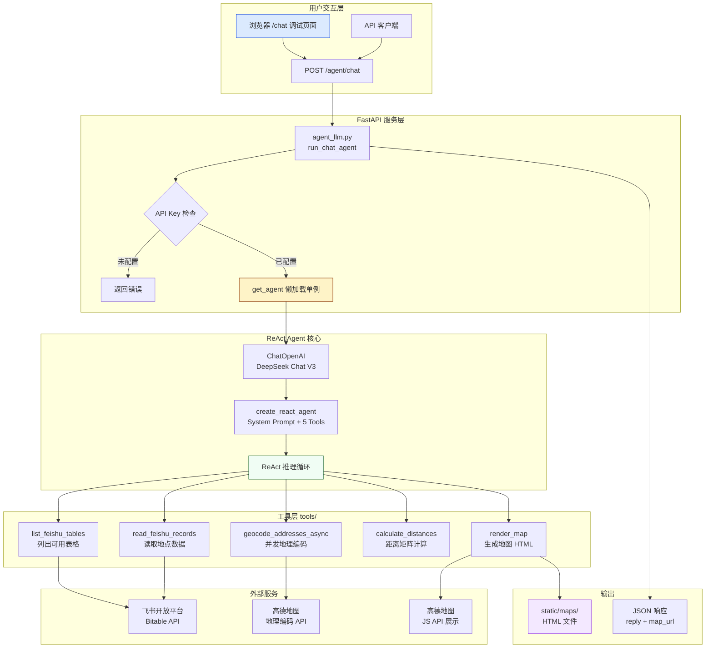
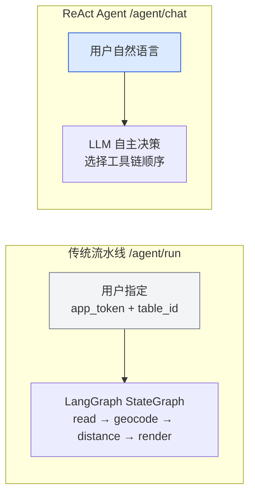

# 功能：基于 DeepSeek LLM 的 ReAct 智能体

## 概述

飞书地图助手新增了基于 **DeepSeek Chat (V3)** 大语言模型的 **ReAct Agent（推理-行动智能体）**，使用户可以通过自然语言对话的方式，自动完成从飞书多维表格读取地点数据、高德地图地理编码、距离矩阵计算到交互式地图 HTML 生成的全流程工作。

此功能通过 `langgraph.prebuilt.create_react_agent` 构建，将 5 个 LangChain 工具注入 Agent，Agent 根据用户的自然语言请求自主决策工具调用链，无需用户手动指定 `app_token` 和 `table_id`。

## 架构



### 双路径对比



## 关键组件

| 组件 | 文件 | 用途 |
|------|------|------|
| `run_chat_agent` | `agent_llm.py` | 入口函数，处理单轮对话，调用 Agent 并提取回复和地图 URL |
| `get_agent` | `agent_llm.py` | 懒加载单例模式创建 ReAct Agent，避免重复初始化 LLM |
| `SYSTEM_PROMPT` | `agent_llm.py` | 系统提示词，定义 Agent 行为约束、工具调用顺序和回复格式 |
| `list_feishu_tables` | `tools/llm_tools.py` | LangChain Tool：列出所有配置的飞书多维表格 |
| `read_feishu_records` | `tools/llm_tools.py` | LangChain Tool：读取指定表格的地点记录 |
| `geocode_addresses_async` | `tools/llm_tools.py` | LangChain Tool：并发调用高德地理编码 API |
| `calculate_distances` | `tools/llm_tools.py` | LangChain Tool：基于 Haversine 公式计算距离矩阵 |
| `render_map` | `tools/llm_tools.py` | LangChain Tool：生成交互式 HTML 地图并返回 URL |
| `AMapClient` | `tools/amap_tool.py` | 高德地图客户端，支持同步和异步（aiohttp + Semaphore 并发控制） |
| `FeishuClient` | `tools/feishu_tool.py` | 飞书开放平台客户端，支持 Bitable 数据读取和表格列表 |
| `Settings` | `config.py` | pydantic-settings 配置类，统一管理所有环境变量 |
| `/chat` 页面 | `static/chat.html` | 调试用聊天 UI，纯前端 HTML，支持 Markdown 渲染和地图链接高亮 |

## 使用方式

### 环境变量配置

在项目根目录创建 `.env` 文件，配置以下环境变量：

```bash
# ========== 必需配置 ==========
# 飞书应用凭证（用于访问 Bitable）
FEISHU_APP_ID=cli_xxxxxxxxxxxxxxxx
FEISHU_APP_SECRET=xxxxxxxxxxxxxxxxxxxxxxxxxxxxxxxx

# 高德地图 Web API Key（用于地理编码）
AMAP_WEB_KEY=xxxxxxxxxxxxxxxxxxxxxxxxxxxxxxxx

# 高德地图 JS API Key（用于前端地图展示）
AMAP_JS_KEY=xxxxxxxxxxxxxxxxxxxxxxxxxxxxxxxx

# DeepSeek API Key（用于 LLM Agent）
DEEPSEEK_API_KEY=sk-xxxxxxxxxxxxxxxxxxxxxxxxxxxxxxxx

# ========== 可选配置 ==========
# API 鉴权 Key（不配置则允许无鉴权访问，适合本地开发）
API_KEY=your-secret-bearer-token

# 服务公网地址（用于生成地图 URL）
PUBLIC_BASE_URL=http://localhost:8000

# 地图输出目录
MAP_OUTPUT_DIR=static/maps

# 已配置的飞书多维表格列表（JSON 数组格式）
FEISHU_APP_TOKENS='[{"app_token":"bascnxxx","name":"深圳门店"},{"app_token":"bascnyyy","name":"北京门店"}]'
```

### 启动服务

```bash
# 安装依赖
pip install -r requirements.txt

# 启动 FastAPI 服务
uvicorn app.main:app --reload --host 0.0.0.0 --port 8000
```

### API 调用示例

#### ReAct Agent 对话接口

```bash
curl -X POST http://localhost:8000/agent/chat \
  -H "Content-Type: application/json" \
  -H "Authorization: Bearer your-api-key" \
  -d '{"query": "帮我生成深圳门店的地图"}'
```

**响应示例：**
```json
{
  "reply": "已为您生成深圳门店的地图！共处理 **5** 个地点，全部地理编码成功。\n\n🔗 [查看地图](http://localhost:8000/maps/abc123def456.html)",
  "map_url": "http://localhost:8000/maps/abc123def456.html",
  "logs": [],
  "error": ""
}
```

#### 调试聊天页面

浏览器访问 `http://localhost:8000/chat`，在页面中粘贴 Bearer Token，然后直接输入自然语言指令：

- 「列出所有可用的表格」
- 「帮我生成深圳门店的地图」
- 「生成北京门店的地图并计算距离」

## Agent 工作流程

Agent 按照 `SYSTEM_PROMPT` 中定义的约束执行以下流程：

1. **列出表格** — 首先调用 `list_feishu_tables` 获取所有已配置的飞书多维表格
2. **读取数据** — 根据用户意图匹配表格后，调用 `read_feishu_records` 读取地点记录
3. **地理编码** — 调用 `geocode_addresses_async` 对地址进行并发的经纬度转换
4. **距离计算**（可选）— 调用 `calculate_distances` 计算地点间的两两距离矩阵
5. **生成地图** — 调用 `render_map` 生成交互式 HTML 地图并返回 URL

Agent 的行为约束：
- **永远先查表再读数据**，禁止猜测表格名称或 app_token
- 意图不明确时列出所有可用表格让用户选择
- 失败时必须告知用户失败原因和失败的工具名称
- 回复始终使用中文

## 技术特点

| 特性 | 实现方式 |
|------|---------|
| LLM 推理 | DeepSeek Chat V3 通过 OpenAI 兼容 API（`langchain_openai.ChatOpenAI`） |
| Agent 框架 | `langgraph.prebuilt.create_react_agent` |
| Agent 生命周期 | 懒加载单例模式，首次调用时初始化，后续复用 |
| 并发控制 | `aiohttp` + `asyncio.Semaphore(max_concurrency=10)` |
| 距离计算 | Haversine 公式，地球半径 6371km |
| 配置管理 | `pydantic-settings` + `.env` 文件 |
| API 鉴权 | Bearer Token（可选，本地开发可跳过） |

## 局限性

- **单轮对话**：当前实现仅支持单轮请求-响应，`session_id` 参数预留但未使用，不支持多轮上下文记忆
- **工具调用不可见**：API 响应仅返回最终回复，不暴露中间工具调用过程和日志
- **无流式输出**：LLM 推理采用同步阻塞模式，不支持 SSE 流式返回
- **无重试机制**：DeepSeek API 调用失败时直接返回错误，不会自动重试
- **表格配置**：Agent 只能访问在 `FEISHU_APP_TOKENS` 中预先配置的表格，无法动态发现


## Related Files

- `agent_llm.py`
- `main.py`
- `config.py`
- `tools/llm_tools.py`
- `static/chat.html`
